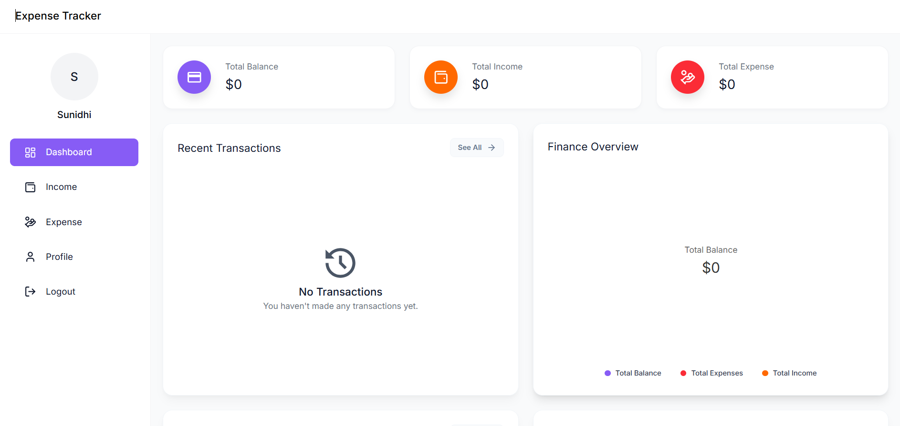
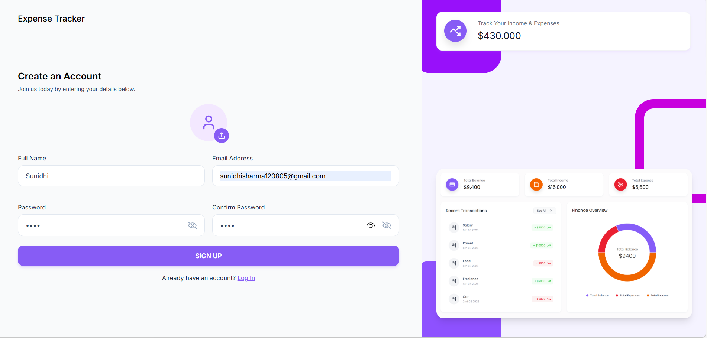

# Budget Tracker 💰

A full-stack expense and income tracking application built with the MERN stack. Track your financial transactions, visualize spending patterns, and manage your budget effectively.

## 🔗 Links

- [Live Demo] https://budgettracker-7127.vercel.app/

---

## 📊 Screenshots

### Dashboard


### Sign Up


---

## 🛠 Technology Stack

### Frontend
- **Framework**: React 19
- **Build Tool**: Vite
- **Styling**: TailwindCSS 4
- **Charts**: Recharts
- **HTTP Client**: Axios
- **Routing**: React Router DOM 7
- **UI Features**: 
  - Emoji Picker
  - React Hot Toast (Notifications)
  - React Icons
- **Linting**: ESLint

### Backend
- **Runtime**: Node.js
- **Framework**: Express.js 5
- **Database**: MongoDB with Mongoose
- **Authentication**: JWT (jsonwebtoken)
- **Password Security**: bcryptjs
- **File Upload**: Multer
- **Data Export**: XLSX
- **Environment**: dotenv
- **Development**: Nodemon


---
## ✨ Features

- **User Authentication**
  - Secure sign-up and login with JWT
  - Password encryption with bcryptjs
  - User profile management

- **Income Tracking**
  - Add and manage income sources
  - Track income by category/source
  - Real-time balance updates

- **Expense Tracking**
  - Log expenses with categories and dates
  - Add descriptions and custom emojis
  - Visual expense organization

- **Dashboard Analytics**
  - Total balance overview
  - Income vs. expense comparison
  - Recent transactions list
  - Finance overview with interactive pie charts
  - Last 30 days expenses visualization
  - Real-time financial metrics

- **Data Visualization**
  - Line charts for financial trends
  - Pie charts for expense/income distribution
  - Bar charts for comparative analysis
  - Custom chart components with legends and tooltips

- **File Management**
  - Profile photo uploads
  - Excel export capabilities for financial reports
  - Secure file handling with multer

---

## 🚀 Getting Started

### Prerequisites
- Node.js (v14 or higher)
- npm or yarn
- MongoDB Atlas account or local MongoDB installation

### Installation

#### 1. Clone the Repository
```bash
git clone https://github.com/Sunidhi-source/budgettracker
cd budget-tracker
```

#### 2. Backend Setup

```bash
cd Backend
npm install
```

Create a `.env` file in the Backend directory:
```env
MONGODB_URI=your_mongodb_connection_string
JWT_SECRET=your_jwt_secret_key
PORT=5000
FRONTEND_URL=http://localhost:5173
```

#### 3. Frontend Setup

```bash
cd ../Frontend
npm install
```

### 🏃 Running the Application

#### Development Mode

**Terminal 1 - Backend:**
```bash
cd Backend
npm run dev
```
Server runs on `http://localhost:5000`

**Terminal 2 - Frontend:**
```bash
cd Frontend
npm run dev
```
Application runs on `http://localhost:5173`

#### Production Build

**Backend:**
```bash
cd Backend
npm start
```

**Frontend:**
```bash
cd Frontend
npm run build
npm run preview
```

---


## 👤 Author

**Sunidhi Sharma**

---


